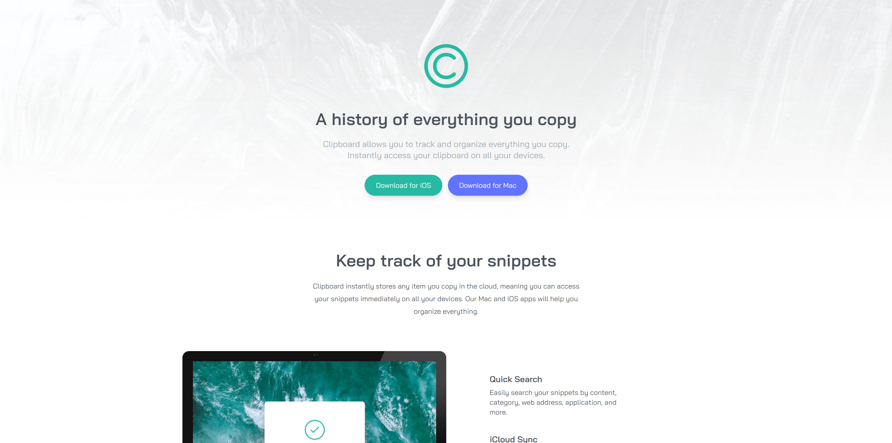

# Tailwind-CSS-From-Scratch-Learn-By-Building-Projects
It will be updated as projects are realized. (They are in order from new to old.)

## Clipboard Website

## Mini Projects Series
> 
> 
> 
> 
> 
